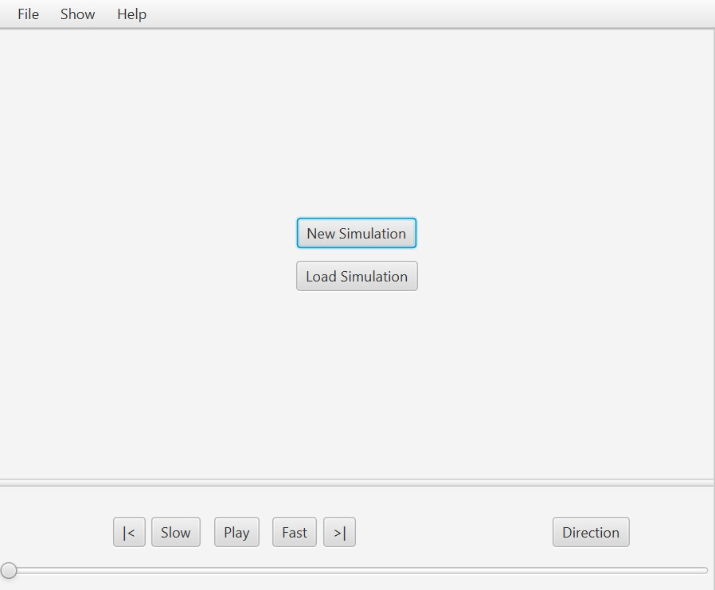
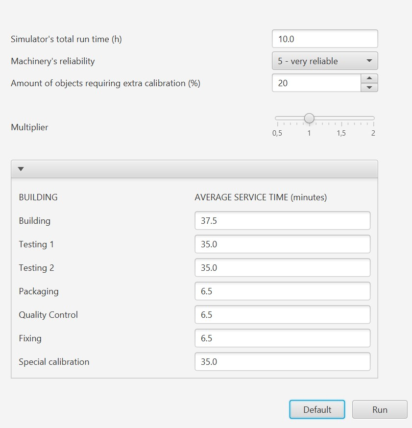
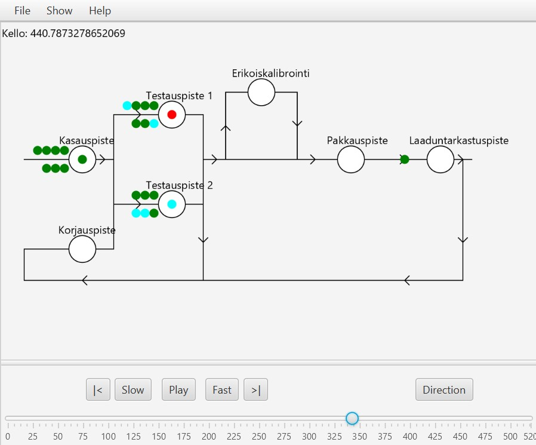
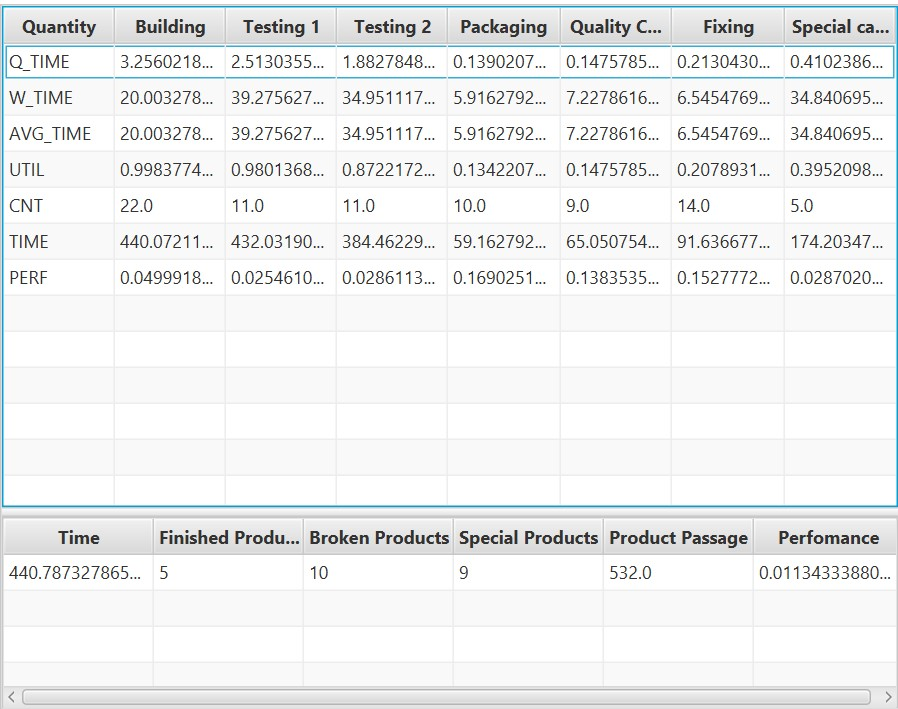
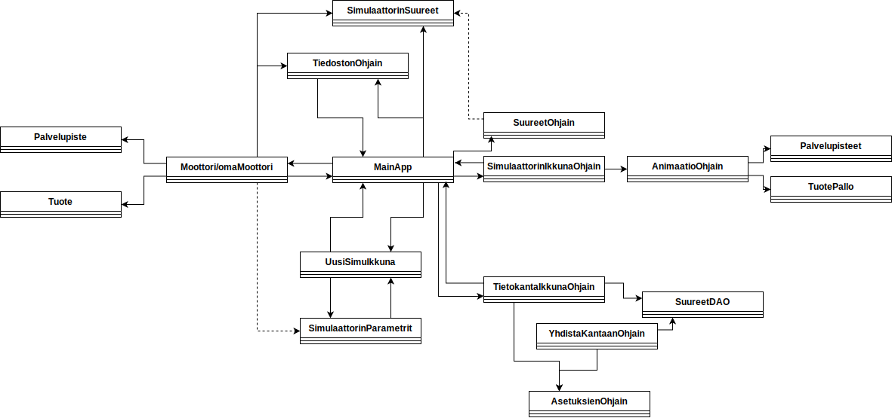

# Ohjelmointiprojekti: Tehdas Simulaattori

## Tehdas Simulaattori

Tehdas Simulaattorilla on tarkoitus simuloida 3-vaihetapahtuma pohjaisesti laitetehdaslinjaston toimintaa. Simulaattori havannollistaa laite "jonojen" syntymistä linjaston eri vaiheissa ja muuttamalla eri parametrejä saadaan simuloitua erivaiheisiin jonoja.

Tehdas simulaattorin kätevän yksinkertainen käyttöliittymä takaa mukavan kokemuksen käyttäjälle. Simulointia voi katsoa yhtä helposti, kuin nykyaikaisen videosoittimen soittamaa videota.

Simulaattori on ottanut inspiraatiota [Vaisala Oyj](https://www.vaisala.com/fi) sääinstrumentti tehtaasta.

## Työkalut
### Käytetyt kirjastot:
- [JavaFX](https://openjfx.io)
- [MariaDB Connector/J](https://mariadb.com/kb/en/about-mariadb-connector-j/) 
- [JUnit 5](https://junit.org/junit5/docs/current/user-guide/)
### Kielet:
- Java
- SQL

### IDE - Ohjelmointiympäristö:
- [Eclipse](https://www.eclipse.org)

## Kuvakaapaukset päänäkymistä:
| Alku-/Päänäkymä | Uusi Simulaatio |
| --- | --- |
|  |  |

| Simuloiti päänäkymä | Suureet näkymä |
| --- | --- |
|  |  |

## Kaaviot

### Luokat ja niiden suhteet:

## Tekijät:
- Leevi Koskinen
- Sanna Kukkonen
- Janne Lähteenmäki

Projekti on suoritettu osana [Metropolian](https://www.metropolia.fi) amk tutkintoa, 2.vuoden kursilla: Oliosovellukset ja tietokannat/Ohjelmointiprojekti

Sovelluksen kehitystyö ei enään jatku meidän osalta.

 

